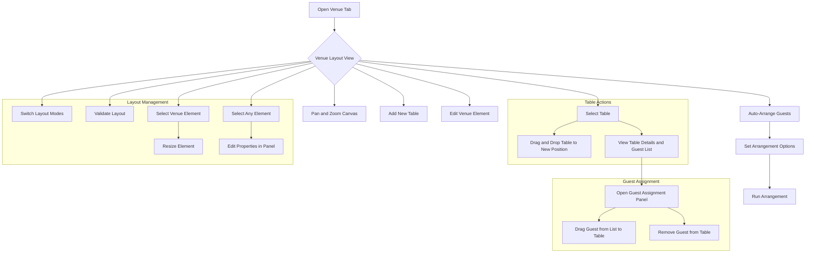

# Venue Management User Flow - Mobile Redesign

This document outlines the user flow for the redesigned mobile venue management interface, focusing on drag-and-drop table arrangement and guest assignment, while ensuring feature parity with the web version.

## 1. Overview

The redesigned interface provides a unified, interactive canvas for managing the venue layout and seating arrangements. Users can directly manipulate tables, assign guests, and view capacity information in a single, intuitive view.

## 2. User Stories

*   As an event planner, I want to visually arrange tables on a canvas so that I can create an accurate floor plan.
*   As an event planner, I want to drag and drop guests from a list onto tables so that I can easily create seating assignments.
*   As an event planner, I want to see real-time capacity updates for each table so that I can avoid overbooking.
*   As an event planner, I want to be able to lock the position of tables and elements to prevent accidental changes.
*   As an event planner, I want to switch between layout design and table management modes so that I can focus on specific tasks.
*   As an event planner, I want to add venue elements from a library so that I can create a complete venue layout.
*   As an event planner, I want to edit element properties in a dedicated panel so that I can fine-tune my layout.
*   As an event planner, I want to view and manage table capacities in a dedicated panel so that I can easily see seating arrangements.
*   As an event planner, I want to zoom in and out of the canvas so that I can work with precision on large layouts.
*   As an event planner, I want to validate my layout to check for issues so that I can ensure a professional result.
*   As an event planner, I want to resize venue elements by dragging their corners so that I can customize their dimensions.

## 3. User Flow Diagram

## 4. Detailed Flows

### 4.1. Arranging Tables

1.  **Open Venue Tab:** The user navigates to the "Venue" tab in the mobile application.
2.  **View Layout:** The user is presented with a visual representation of the venue, including all tables and elements.
3.  **Select a Table:** The user taps and holds on a table to select it.
4.  **Drag and Drop:** The user drags the selected table to a new position on the canvas and releases to place it.
5.  **Save Layout:** The new position is automatically saved.

### 4.2. Assigning and Reassigning Guests

1.  **Open Guest Panel:** The user taps the "Guests" tab in the bottom panel to view a list of all guests, categorized as "Assigned" and "Unassigned".
2.  **Assigning an Unassigned Guest:** The user selects the "Unassigned" list, then drags a guest from the list and drops them onto a table on the canvas. The table's capacity updates instantly.
3.  **Viewing a Table's Guests:** The user taps on a specific table on the canvas. This opens a "Table Details" view, showing all guests currently seated at that table.
4.  **Reassigning a Seated Guest:** From the "Table Details" view, the user can drag a guest and drop them onto a different table on the canvas to reassign them. The capacity of both affected tables is updated.

### 4.3. Auto-Arranging Guests

1.  **Trigger Auto-Arrange:** The user taps the "Auto-Arrange" button in the main venue view.
2.  **Set Options:** A modal appears, allowing the user to configure the arrangement options (e.g., "Keep Families Together," "Respect Relationships").
3.  **Run Arrangement:** The user confirms the options, and the system automatically assigns guests to the available, unlocked tables.
4.  **Review and Adjust:** The user can then review the automated arrangement and make manual adjustments as needed.

### 4.4. Arrangement Actions

1.  **Undo:** The user can tap the "Undo" button to reverse the last action (e.g., moving a table, assigning a guest).
2.  **Redo:** The user can tap the "Redo" button to re-apply an action that was just undone.
3.  **Reset All:** The user can tap the "Reset All" button to unassign all guests from all tables (excluding locked tables), providing a clean slate. A confirmation dialog will prevent accidental resets.

### 4.5. Creating New Elements

1.  **Add Table:** The user taps the "Tables" tab in the bottom panel, which reveals an "Add Table" button. Tapping this button opens a modal where the user can define the new table's properties (name, capacity).
2.  **Add Venue Element:** The user taps the "Elements" tab in the bottom panel, which opens a library of available venue elements (e.g., Stage, Dance Floor). Tapping an element adds it to the canvas.
### 4.6. Working with Layout Modes

1.  **Switch to Layout Design Mode:** The user taps the "Layout Design" mode button in the toolbar to focus on arranging venue elements.
2.  **Access Element Library:** In Layout Design mode, the user can access the element library to add venue elements.
3.  **Switch to Table Management Mode:** The user taps the "Table Management" mode button in the toolbar to focus on table arrangements and guest assignments.
4.  **View Table Capacity Panel:** In Table Management mode, the user can view the table capacity panel to see detailed seating information.

### 4.7. Editing Element Properties

1.  **Select an Element:** The user taps on any venue element or table to select it.
2.  **View Properties Panel:** When an element is selected, the properties panel appears on the side.
3.  **Edit Properties:** The user can modify element properties such as name, position, dimensions, and capacity.
4.  **Save Changes:** Changes are automatically saved when the user modifies any property.

### 4.8. Using Zoom Controls

1.  **Zoom In:** The user can tap the "+" button in the zoom controls or pinch-to-zoom to get a closer view of the layout.
2.  **Zoom Out:** The user can tap the "-" button in the zoom controls to see more of the layout.
3.  **View Zoom Level:** The current zoom level is displayed between the zoom buttons.

### 4.9. Validating Layout

1.  **Trigger Validation:** The user taps the "Validate" button in the toolbar.
2.  **View Results:** A modal appears showing any validation errors or warnings.
3.  **Close Validation:** The user can close the validation results modal to return to the layout.

### 4.10. Resizing Venue Elements

1.  **Select a Venue Element:** The user taps on a venue element (not a table) to select it.
2.  **See Resize Handles:** When selected, resize handles appear at the corners of the element.
3.  **Drag Resize Handle:** The user drags any resize handle to change the element's dimensions.
4.  **Release to Save:** When the user releases the handle, the new dimensions are saved.